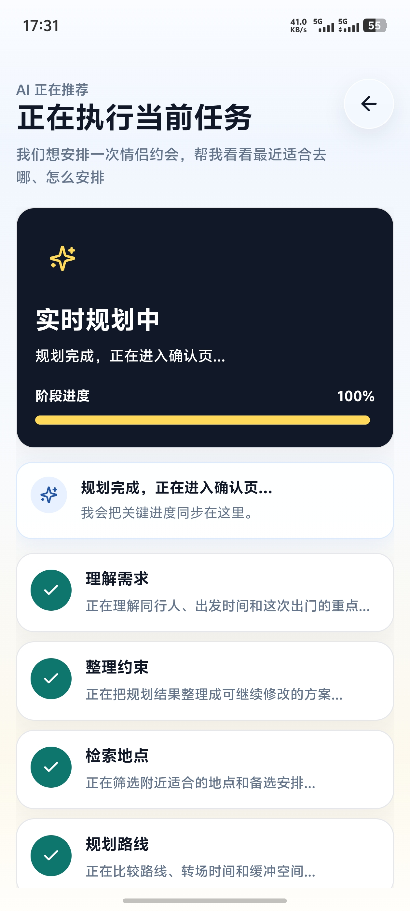
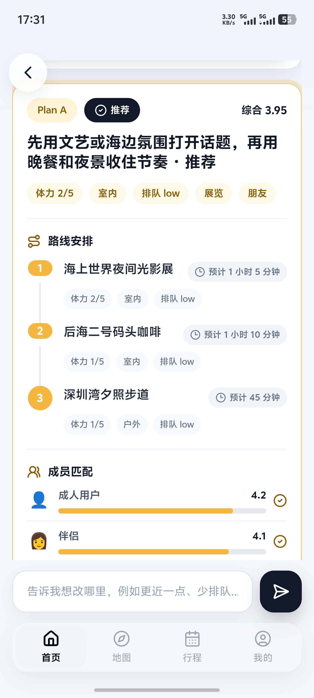
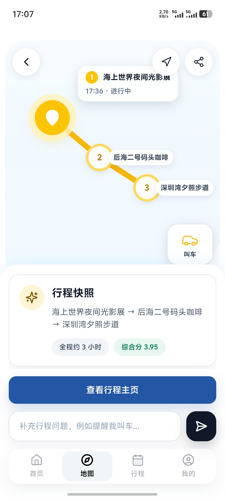
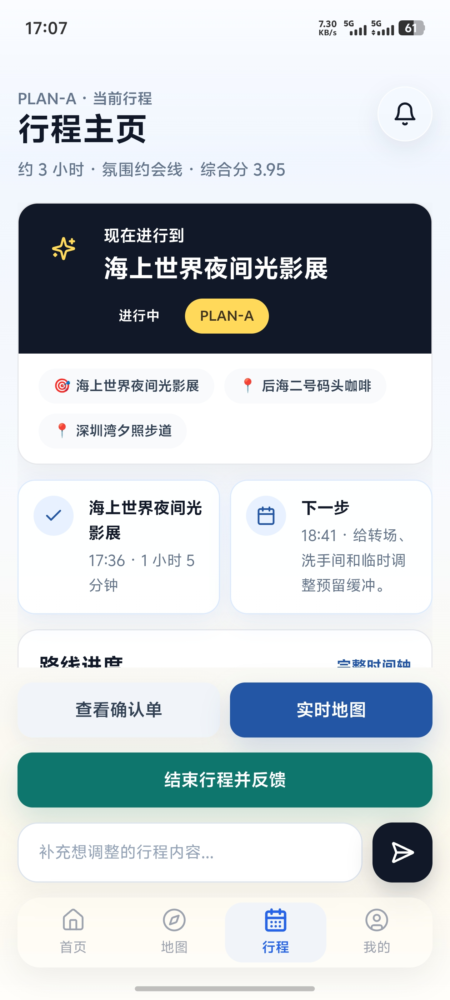
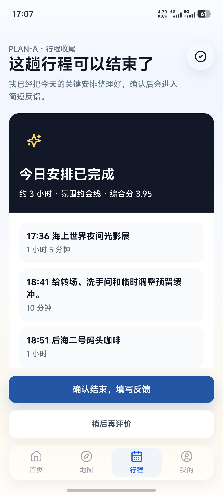
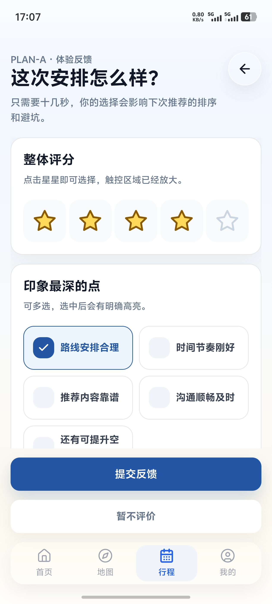
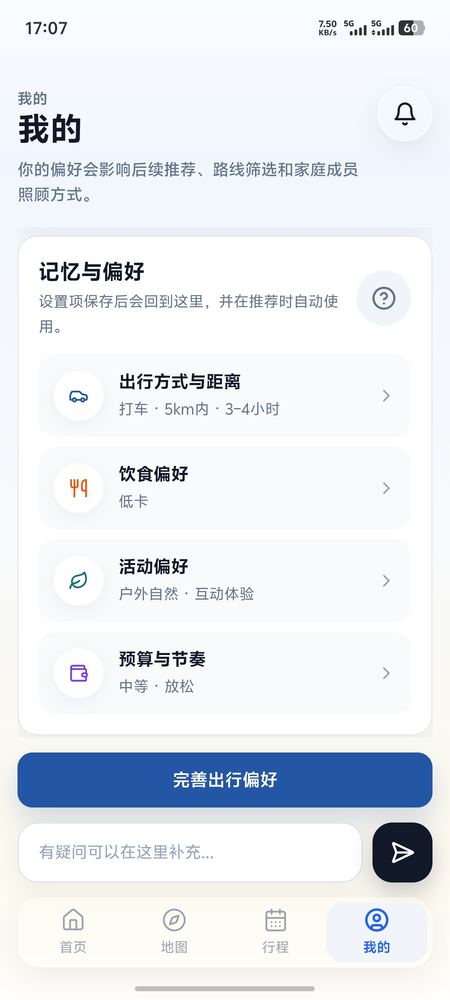
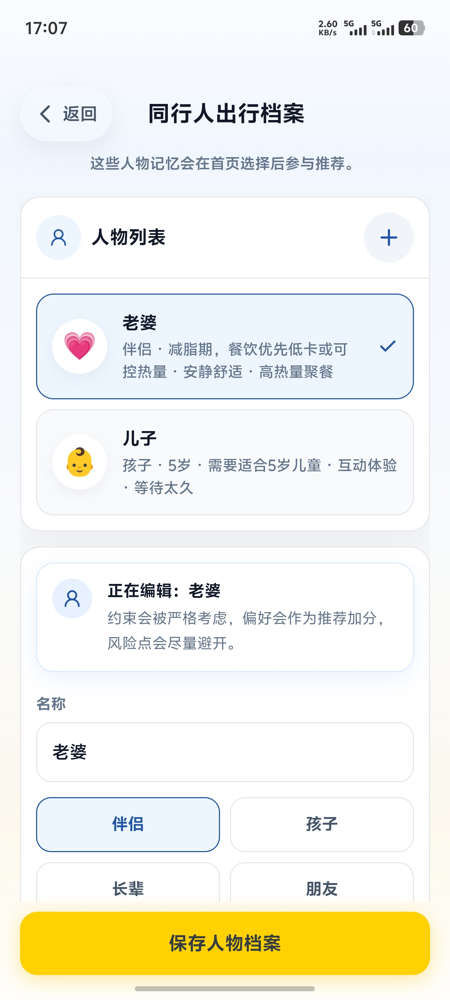
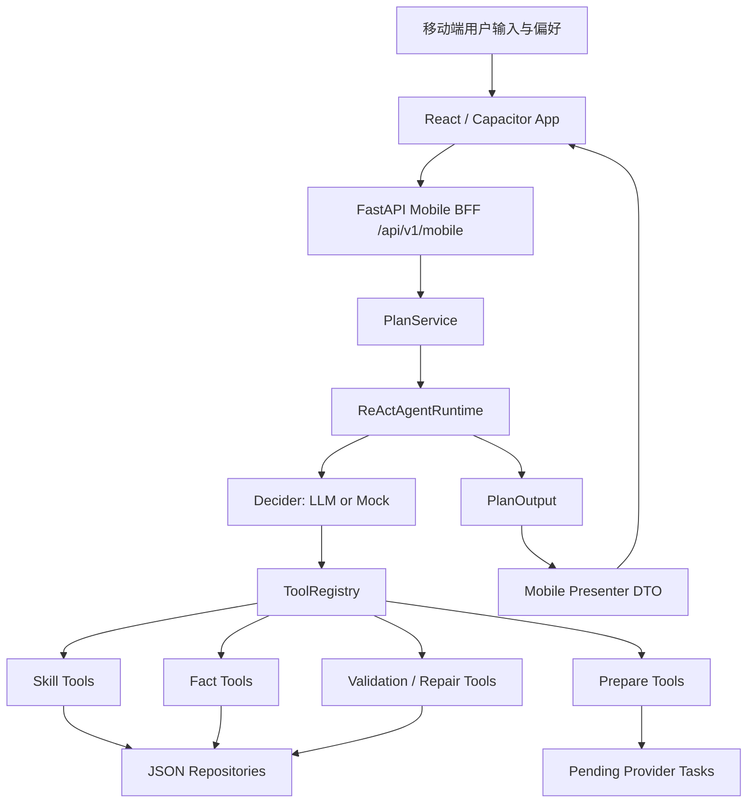

# Weekend Agent

Weekend Agent 是一个面向周末出行和本地探索场景的移动端 Agent 应用。它不是只做静态路线展示，而是把自然语言需求、同行人偏好、POI/天气/排队/路线等本地工具、约束校验与方案修复串成一条可交互的规划链路，最终生成 Plan A / Plan B、推荐方案、时间轴、预约待办、行程中地图和反馈记忆。

当前项目包含：

- React + Vite + Tailwind 前端，以及 Capacitor Android 壳。
- FastAPI Mobile BFF 和规划后端。
- ReAct Agent Runtime，支持 LLM/Mock Decider、工具注册、策略约束、状态归约、校验与修复。
- 本地 JSON 数据资产，包括 POI、路线边、排队、天气、用户记忆、反馈和运行时状态。

生产移动端 API 默认指向：

```text
https://weekendagent.fcxy.online/api/v1/mobile
```

## App 截图

<table>
  <tr>
    <td align="center"><br/>首页场景快选</td>
    <td align="center"><br/>AI 任务进度</td>
    <td align="center"><br/>方案对比</td>
  </tr>
  <tr>
    <td align="center"><br/>行程中地图</td>
    <td align="center"><br/>行程主页</td>
    <td align="center"><br/>行程收尾</td>
  </tr>
  <tr>
    <td align="center"><br/>体验反馈</td>
    <td align="center"><br/>偏好记忆</td>
    <td align="center"><br/>同行人档案</td>
  </tr>
</table>

## 核心能力

- 自然语言出行规划：从“今天下午带老婆孩子出去玩，别太远，老婆减脂，孩子 5 岁”这类输入中抽取城市、时长、同行角色、硬约束和软偏好。
- 多人偏好协商：识别儿童安全、饮食限制、体力节奏、预算、天气和距离之间的冲突，并生成折中策略。
- 方案生成与对比：生成多个候选计划，补齐 POI、路线、时间轴、费用和推荐理由。
- 工具增强 Agent：通过工具查询 POI、路线、天气、排队和用户记忆；通过 prepare tools 生成预约、叫车、分享等待确认任务。
- 约束校验与自动修复：输出前执行硬约束检查，发现阻塞性问题时调用 repair tool 进行修复。
- 移动端 BFF：为首页、对话页、方案对比、时间轴、待办、支付页、行程中地图、行程主页和个人偏好页提供页面级 DTO。
- SSE 规划进度：移动端可以实时展示 Agent 正在理解需求、筛选地点、计算路线、校验方案和评分推荐。
- 反馈记忆闭环：行程结束后的评分和偏好会写入本地记忆，用于后续推荐和同行人照顾方式。

## 技术栈

| 层 | 技术 |
| --- | --- |
| 移动端 | React 18, TypeScript, Vite, Tailwind CSS, React Router, Lucide React |
| Android | Capacitor 8, Gradle |
| 后端 | FastAPI, Pydantic v2, Uvicorn |
| Agent | ReAct runtime, ToolRegistry, Policy, StateReducer, validator-guided repair |
| LLM | Mock LLM, OpenAI-compatible Chat Completions |
| 数据 | Local JSON repositories, runtime state files |
| 测试 | pytest, ruff, Vite build |

## 系统架构



## Agent 链路

默认后端运行 `AGENT_RUNTIME=react`。它不是完全写死的单条流水线，而是由 Decider 在每一步选择 action，再由 Policy 约束必要的前置条件和安全边界。

一次完整规划大致经历：

1. 读取记忆：`read_user_memory` 加载用户偏好、历史反馈和同行人档案。
2. 需求采集：`intake_user_requirements` 抽取时间、地点、同行人、预算、距离、活动类型等 slot。
3. 可选澄清：`clarify_requirements` 判断是否必须追问，或能否基于安全默认假设继续。
4. 用户理解：`understand_user` 形成群体上下文、角色画像、硬约束和隐藏需求。
5. 冲突检测：`detect_conflicts` 识别饮食、儿童安全、体力、预算、天气等潜在冲突。
6. 协商策略：`generate_negotiation_strategy` 为多人偏好生成折中策略。
7. 候选体验：`draft_experience_plan` 生成 Plan A / Plan B 的阶段结构。
8. 地点选择：`select_places` 调用 POI、天气、排队工具，为每个阶段选择地点。
9. 路线计算：`calculate_routes` 计算 POI 之间的转场路线和时间。
10. 时间轴构建：`build_timeline` 生成可落地的行程时间线。
11. 约束校验：`validate_plan_constraints` 检查硬约束、距离、营业时间、安全和阻塞性问题。
12. 自动修复：`repair_plan` 在校验失败时尝试替换地点、调整阶段或重建时间线。
13. 评分推荐：`score_candidates` 对候选方案打分并选择推荐方案。
14. 执行准备：`booking_prepare`、`taxi_prepare`、`share_prepare` 生成需要用户确认的执行任务。
15. 最终输出：PlanOutput 经过 Mobile Presenter 转成页面级 DTO，供移动端渲染。

同时支持事件驱动重规划和自然语言修改：

- `interpret_revision_request`
- `replace_poi`
- `revise_dining_stage`
- `add_followup_stage`
- `remove_followup_stage`
- `apply_plan_patch`
- `rebuild_timeline`
- `explain_changes`

## 可调用工具

| 类别 | 工具 | 作用 |
| --- | --- | --- |
| 记忆 | `read_user_memory` | 读取用户偏好、同行人和历史反馈 |
| 需求理解 | `intake_user_requirements`, `clarify_requirements`, `understand_user` | 解析自然语言、追问缺失信息、构建群体上下文 |
| 冲突与策略 | `detect_conflicts`, `generate_negotiation_strategy` | 检测多人约束冲突并生成协商策略 |
| 方案生成 | `draft_experience_plan`, `select_places`, `calculate_routes`, `build_timeline`, `score_candidates` | 生成候选计划、选点、算路、排时间轴和评分 |
| 事实查询 | `poi_search`, `poi_detail`, `route_search`, `weather_lookup`, `queue_lookup` | 查询 POI、路线、天气和排队状态 |
| 校验修复 | `validate_plan_constraints`, `repair_plan` | 输出前校验硬约束并尝试自动修复 |
| 修改方案 | `interpret_revision_request`, `replace_poi`, `revise_dining_stage`, `add_followup_stage`, `remove_followup_stage`, `apply_plan_patch`, `rebuild_timeline`, `explain_changes` | 支持用户继续说“换个地方”“饭后加一个小酒馆”“取消喝酒”等 |
| 执行准备 | `booking_prepare`, `taxi_prepare`, `share_prepare` | 生成待确认预约、叫车、分享任务，不直接调用真实第三方 |

## 前端结构

主要页面位于 `src/screens`：

- `HomeScreen`：首页、场景快选、自然语言输入。
- `AiTaskProgressScreen` / `IphonePro`：SSE 任务进度和澄清对话。
- `PlanCompareScreen`：Plan A / Plan B 对比。
- `TimelineRouteScreen`：详细时间轴和路线。
- `BookingTodosScreen` / `BookingCheckoutScreen` / `PaymentScreen`：预约待办、确认和支付流程。
- `TripLiveMapScreen`：行程中地图和实时卡片。
- `ItineraryHubScreen`：当前行程和历史行程。
- `TripWrapScreen` / `TripFeedbackScreen`：行程收尾与反馈。
- `ProfileScreen` / `CompanionProfilesScreen`：个人偏好与同行人档案。
- `TravelModeSettingsScreen`、`DietaryPreferencesScreen`、`ActivityPreferencesScreen`、`BudgetPacePreferencesScreen`：偏好设置。

前端 API 封装位于 `src/lib/api`。移动端请求会携带匿名设备用户头：

```http
X-Device-User-Id: phone_<generated-id>
```

## 后端结构

```text
backend/local_explorer_agent/app
├── api/v1               # FastAPI 路由，包括 plans、mobile、feedback、events
├── agent/react          # ReAct runtime、decider、executor、policy、reducer、tools
├── agent/skills         # 用户理解、冲突检测、协商、选点、路线、时间轴等 skill
├── tools                # POI、route、queue、weather、booking、taxi、share 等底层工具
├── repositories         # 本地 JSON repository
├── mobile               # 移动端 DTO、preset 和 presenter
├── domain               # Pydantic 领域模型、枚举、评分、校验
└── data                 # sample/full JSON 数据和 runtime 状态目录
```

## 快速开始

### 1. 启动后端

```bash
cd backend
pip install -e .
python -m uvicorn local_explorer_agent.app.main:app --reload
```

健康检查：

```bash
curl http://127.0.0.1:8000/api/v1/health
curl http://127.0.0.1:8000/api/v1/meta/data-health
```

### 2. 启动前端

在仓库根目录创建 `.env.local`：

```env
VITE_API_BASE_URL=http://localhost:8000/api/v1/mobile
```

然后运行：

```bash
npm install
npm run dev
```

浏览器访问：

```text
http://localhost:5173/
```

### 3. 构建 Android

```bash
npm run build:android
cd android
.\gradlew.bat assembleDebug
```

Debug APK 通常输出到：

```text
android/app/build/outputs/apk/debug/app-debug.apk
```

Android 模拟器中，前端会把 `localhost` / `127.0.0.1` 映射到 `10.0.2.2`。真机调试时可以额外设置：

```env
VITE_API_ANDROID_BASE_URL=http://<电脑局域网IP>:8000/api/v1/mobile
```

## LLM 配置

默认使用 Mock LLM，可离线跑通完整链路：

```env
LLM_PROVIDER=mock
AGENT_RUNTIME=react
```

接入 OpenAI-compatible 服务：

```env
LLM_PROVIDER=openai
LLM_API_KEY=your_api_key
LLM_BASE_URL=https://api.openai.com/v1
LLM_MODEL=gpt-4o-mini
LLM_API_STYLE=chat_completions
LLM_TRUST_ENV=false
```

可选运行参数：

```env
DATA_DIR=local_explorer_agent/app/data
AGENT_MAX_STEPS=20
AGENT_MAX_TOOL_CALLS=30
AGENT_MAX_REPAIR_ATTEMPTS=2
```

如果 `LLM_PROVIDER=openai` 但 key 或响应结构异常，当前实现会记录错误并按配置回退到规则/Mock 路径，保证 demo 链路尽量可运行。

## API 示例

创建一次移动端规划会话：

```bash
curl -X POST http://127.0.0.1:8000/api/v1/mobile/travel/sessions \
  -H "Content-Type: application/json" \
  -H "X-Device-User-Id: phone_demo" \
  -d '{
    "message": "今天下午想和老婆孩子出去玩几小时，别太远，老婆最近在减肥，孩子5岁",
    "companionIds": ["self"]
  }'
```

流式查看 Agent 进度：

```bash
curl -N -X POST http://127.0.0.1:8000/api/v1/mobile/travel/sessions/stream \
  -H "Content-Type: application/json" \
  -H "X-Device-User-Id: phone_demo" \
  -d '{"message":"今晚想找个地方吃饭，然后散步聊天"}'
```

更多移动端契约见 `ENDPOINTS.md`。

## 测试与检查

后端：

```bash
cd backend
pytest
ruff check .
```

前端：

```bash
npm run build
```

## License

当前仓库未声明开源许可证。正式公开前请补充 License，并确认第三方素材、截图和数据源的使用权限。
