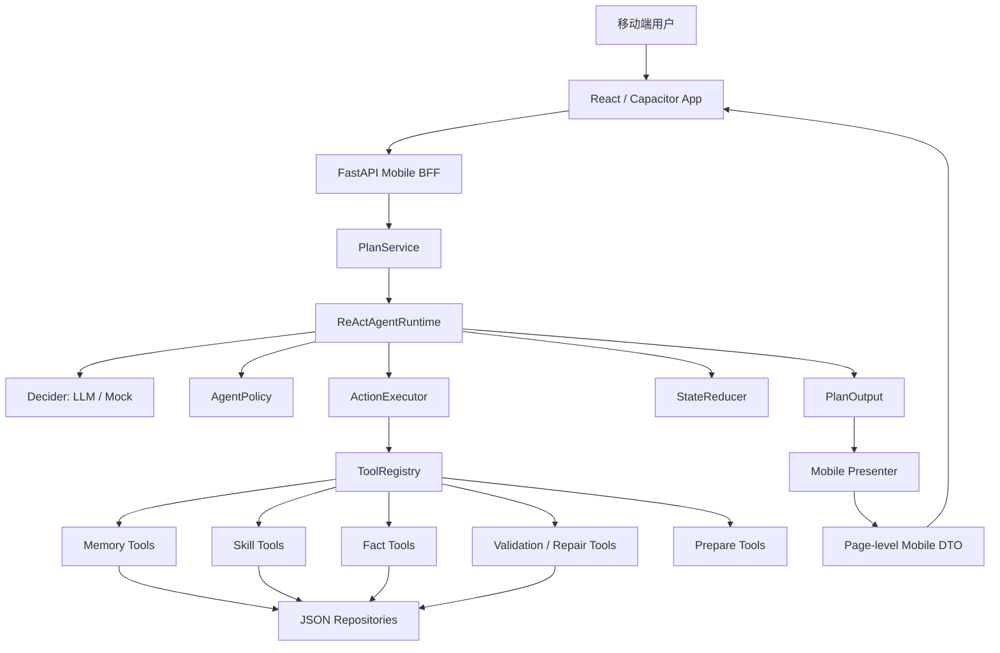
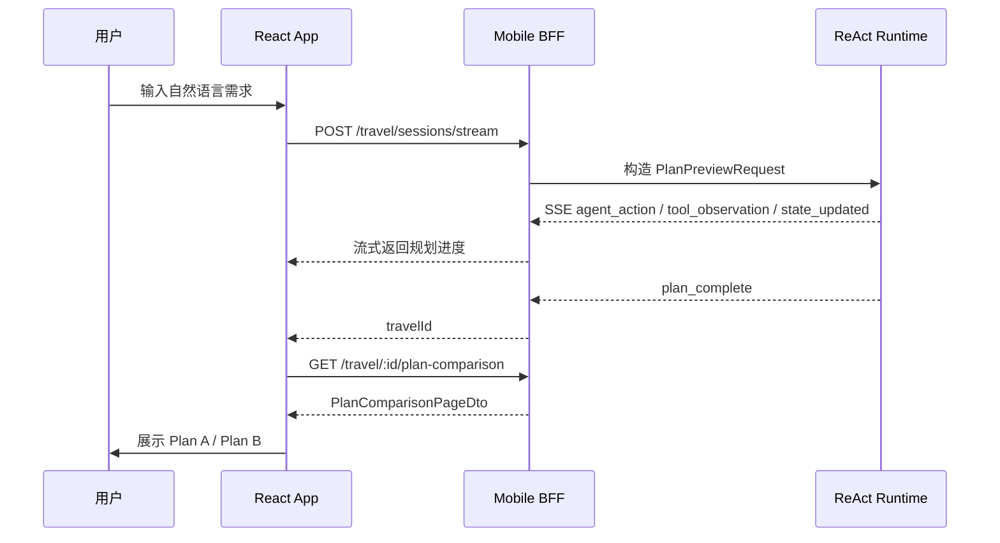
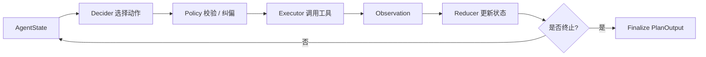

# Weekend Agent 项目文档

## 1. 项目概述

Weekend Agent 是一个面向“周末出行 / 本地探索”的移动端 Agent 应用，目标是把用户临时起意的出门想法，快速转化成可以直接执行的行程方案。

用户只需要用自然语言描述需求，例如“今晚想约会，别太累，想有点夜景”，系统会自动理解出行意图、同行人偏好、时间距离、体力节奏和场景氛围，并结合地点、天气、排队、路线等工具信息，生成更贴近真实出行决策的 Plan A / Plan B。每个方案会包含推荐理由、时间轴、地图路线、预约待办和注意事项，行程结束后的反馈也会沉淀为记忆，用于优化后续推荐。

从工程形态上看，本项目不是单纯的页面 Demo，而是一个包含移动端、后端 BFF、Agent Runtime、工具系统、本地数据资产和反馈记忆闭环的端到端原型。

## 2. 项目目标

项目主要解决三个问题：

1. 降低周末出行决策成本：用户不用手动查地点、比路线、算时间、考虑排队和天气，只需要说出想法。
2. 支持多人偏好协商：系统能识别情侣、亲子、朋友等不同同行场景中的冲突，例如饮食限制、儿童安全、体力节奏、预算和距离。
3. 验证 Agent 工具编排能力：通过 ReAct Runtime 让模型或 Mock Decider 自主选择下一步动作，包括读记忆、解析需求、调用工具、校验方案、修复冲突和输出移动端页面数据。

## 3. 核心功能

### 3.1 自然语言出行规划

用户从首页输入一句自然语言需求，系统会抽取城市、时间、时长、同行人、活动偏好、距离限制、预算、饮食限制和场景氛围等信息。若关键信息缺失，系统可以生成澄清问题；若可以基于安全默认假设继续，则直接推进规划流程。

### 3.2 多人偏好理解与冲突检测

系统会根据用户记忆、同行人档案和输入文本构建群体上下文，包括角色画像、硬约束、软偏好和风险点。随后检测潜在冲突，例如：

- 亲子出行中的儿童安全、体力和距离限制。
- 情侣约会中的氛围、拍照、夜景和疲劳度平衡。
- 减脂饮食、预算、排队时间和行程节奏之间的矛盾。

### 3.3 Plan A / Plan B 方案生成

Agent 会生成多个候选方案，并为每个方案补齐阶段结构、POI、路线、时间轴、费用估计、满意度评分和推荐理由。前端以 Plan A / Plan B 对比卡片展示，便于用户选择。

### 3.4 工具增强 Agent

项目将 POI、路线、天气、排队、记忆、校验、修复和执行准备拆成工具。Agent 不直接“编造”全部结果，而是通过工具查询和状态归约逐步形成可落地方案。

### 3.5 约束校验与自动修复

方案输出前会经过硬约束校验，包括距离、营业时间、儿童安全、饮食限制、排队风险等。如果发现阻塞性问题，Agent 会调用 repair tool 尝试替换地点、调整阶段或重建时间轴。

### 3.6 移动端页面级 DTO

后端不是只返回原始 PlanOutput，而是通过 Presenter 转换成适合手机页面直接渲染的 DTO，包括首页、对话页、方案对比、时间轴、预约待办、支付预览、行程中地图、行程主页、反馈页和个人偏好页。

### 3.7 反馈记忆闭环

行程结束后，用户反馈会写入本地记忆和历史记录。后续规划时，Agent 会读取用户偏好、同行人档案和历史反馈，使推荐越来越贴近用户习惯。

## 4. 技术栈

| 模块 | 技术 |
| --- | --- |
| 移动端前端 | React 18, TypeScript, Vite, Tailwind CSS, React Router |
| Android 壳 | Capacitor 8, Gradle |
| 后端服务 | FastAPI, Pydantic v2, Uvicorn |
| Agent Runtime | ReAct Runtime, Decider, ToolRegistry, Policy, Executor, StateReducer |
| LLM 接入 | Mock LLM, OpenAI-compatible Chat Completions |
| 数据存储 | Local JSON Repository, runtime JSON state |
| 测试 | pytest, ruff, Vite build |
| 官网展示 | Static HTML, App screenshots, APK download page |

## 5. 总体架构



系统分为四层：

- 移动端表现层：负责页面展示、用户输入、SSE 进度展示和页面跳转。
- Mobile BFF 层：将移动端请求转换为规划请求，并把领域模型映射为页面级 DTO。
- Agent 编排层：负责 ReAct 决策、工具调用、策略约束、状态归约、校验修复和最终输出。
- 数据与工具层：通过本地 JSON Repository 提供 POI、路线、天气、排队、记忆和反馈数据。

## 6. 前端设计

### 6.1 页面结构

前端主路由位于 `src/routes.ts` 和 `src/App.tsx`。主要页面包括：

| 页面 | 路由 | 说明 |
| --- | --- | --- |
| 首页 | `/`, `/home` | 场景快选、自然语言输入、历史行程 |
| AI 执行中 | `/ai-task` | 展示 Agent 规划进度 |
| 对话澄清页 | `/chat` | 展示需求理解、澄清问题和补充输入 |
| 方案对比 | `/plans` | Plan A / Plan B 对比 |
| 时间轴路线 | `/itinerary/timeline` | 详细时间轴和路线 |
| 预约待办 | `/itinerary/booking` | 预约、叫车、分享等执行前任务 |
| 预约确认 | `/itinerary/checkout` | 预约详情和确认 |
| 支付预览 | `/itinerary/payment` | 费用明细和付款方式展示 |
| 行程中地图 | `/itinerary/map-live` | 行程中地图和实时卡片 |
| 行程主页 | `/itinerary/journey` | 当前行程与历史行程 |
| 行程反馈 | `/itinerary/trip-feedback` | 行程评分和偏好反馈 |
| 我的 | `/profile` | 用户偏好、同行人档案、设置 |

### 6.2 API 封装

前端 API 封装位于 `src/lib/api`。核心特点：

- `client.ts` 统一封装 fetch、JSON 解析、错误格式和网络异常。
- `config.ts` 读取 `VITE_API_BASE_URL`，并在 Android 模拟器中将 `localhost` 自动映射为 `10.0.2.2`。
- 所有移动端请求会携带匿名设备用户头 `X-Device-User-Id`。
- `travel.service.ts` 支持普通规划请求和 SSE 流式规划请求。
- `types.ts` 定义前后端契约 DTO，保证页面数据结构清晰。

### 6.3 移动端交互流程



## 7. 后端设计

### 7.1 后端模块结构

```text
backend/local_explorer_agent/app
├── api/v1               # FastAPI 路由
├── services             # 应用服务，如 PlanService、FeedbackService
├── agent/react          # ReAct Runtime、Decider、Policy、ToolRegistry、Executor、Reducer
├── agent/skills         # 用户理解、冲突检测、协商、选点、路线、时间轴等 Skill
├── tools                # POI、route、queue、weather、booking、taxi、share 等底层工具
├── repositories         # 本地 JSON Repository
├── mobile               # 移动端 DTO、Preset 和 Presenter
├── domain               # Pydantic 领域模型、枚举、评分、校验
└── data                 # sample/full JSON 数据和 runtime 状态目录
```

### 7.2 FastAPI 入口

后端入口为 `backend/local_explorer_agent/app/main.py`。它负责：

- 创建 FastAPI 应用。
- 注册 CORS 中间件。
- 挂载 `/api/v1` 路由。
- 统一处理 NotFound、LLMError、HTTPException 和请求校验错误。

### 7.3 PlanService

`PlanService` 是后端规划能力的应用服务入口。它负责：

- 创建规划预览。
- 保存和读取 session。
- 在澄清问题回答后继续规划。
- 根据自然语言修改已有方案。
- 处理事件驱动重规划。
- 确认方案并触发反馈 follow-up。

当 `react_runtime` 可用时，`PlanService` 会调用 ReAct Runtime；否则可回退到旧版 Orchestrator。

## 8. Agent 编排设计

### 8.1 ReAct Runtime 核心对象

ReAct Runtime 位于 `backend/local_explorer_agent/app/agent/react`，核心对象包括：

| 对象 | 作用 |
| --- | --- |
| `ReActAgentRuntime` | 主循环，驱动 decide -> execute -> reduce |
| `AgentDecider` | 根据当前状态和工具列表选择下一步动作 |
| `MockReActDecider` | 无 LLM 时的规则化决策器 |
| `LLMReActDecider` | OpenAI-compatible LLM 决策器 |
| `AgentPolicy` | 校验动作是否合法，控制步骤数、工具调用数、前置条件和修复次数 |
| `ActionExecutor` | 调用 ToolRegistry 中的工具 |
| `StateReducer` | 根据 action 和 observation 更新 AgentState |
| `ToolRegistry` | 注册、查询和暴露工具规格 |
| `AgentState` | 保存规划过程中的记忆、需求、冲突、候选方案、校验结果和 trace |

### 8.2 Agent 运行循环



Runtime 每一步会：

1. Decider 根据当前 `AgentState` 和工具列表选择动作。
2. Policy 校验动作是否满足前置条件，例如必须先读记忆、再做需求采集；必须先检测冲突，再生成方案。
3. Executor 调用对应工具并得到 observation。
4. Reducer 将 observation 写回状态。
5. 若状态达到 `completed`、`failed` 或 `needs_user_input`，结束循环。

### 8.3 标准规划链路

一次完整规划通常包含以下阶段：

1. `read_user_memory`：读取用户偏好、同行人档案和历史反馈。
2. `intake_user_requirements`：抽取时间、地点、同行人、预算、距离、活动类型等 slot。
3. `clarify_requirements`：判断是否需要澄清，或能否基于安全假设继续。
4. `understand_user`：构建群体上下文、角色画像、硬约束和隐藏需求。
5. `detect_conflicts`：识别饮食、儿童安全、体力、预算、天气等冲突。
6. `generate_negotiation_strategy`：为多人偏好生成折中策略。
7. `draft_experience_plan`：生成 Plan A / Plan B 的阶段结构。
8. `select_places`：调用 POI、天气、排队工具选择地点。
9. `calculate_routes`：计算地点之间的路线和转场时间。
10. `build_timeline`：生成可执行时间轴。
11. `validate_plan_constraints`：校验硬约束、距离、营业时间和安全风险。
12. `repair_plan`：校验失败时调整地点、阶段或时间轴。
13. `score_candidates`：对候选方案打分并选择推荐方案。
14. `booking_prepare`、`taxi_prepare`、`share_prepare`：生成待确认执行任务。
15. `final_answer`：输出最终 PlanOutput。

### 8.4 可调用工具

| 类别 | 工具 | 说明 |
| --- | --- | --- |
| 记忆 | `read_user_memory` | 读取用户偏好、同行人和历史反馈 |
| 需求理解 | `intake_user_requirements`, `clarify_requirements`, `understand_user` | 解析自然语言、补齐 slot、构建群体上下文 |
| 冲突与策略 | `detect_conflicts`, `generate_negotiation_strategy` | 检测多人约束冲突并生成协商策略 |
| 方案生成 | `draft_experience_plan`, `select_places`, `calculate_routes`, `build_timeline`, `score_candidates` | 生成候选计划、选点、算路、排时间轴和评分 |
| 事实查询 | `poi_search`, `poi_detail`, `route_search`, `weather_lookup`, `queue_lookup` | 查询 POI、路线、天气和排队状态 |
| 校验修复 | `validate_plan_constraints`, `repair_plan` | 输出前校验硬约束并自动修复 |
| 修改方案 | `interpret_revision_request`, `replace_poi`, `revise_dining_stage`, `add_followup_stage`, `remove_followup_stage`, `apply_plan_patch`, `rebuild_timeline`, `explain_changes` | 支持自然语言修改已有方案 |
| 执行准备 | `booking_prepare`, `taxi_prepare`, `share_prepare` | 生成待确认预约、叫车、分享任务 |

### 8.5 Policy 约束

`AgentPolicy` 保证 Agent 不会无序调用工具，主要约束包括：

- 限制最大步骤数和最大工具调用次数。
- preview 阶段禁止真实执行类工具。
- 必须先读取用户记忆和采集需求，再进入核心规划工具。
- 必须先进行冲突检测，再生成方案或继续后续规划。
- 如果存在冲突，必须先生成协商策略。
- 输出最终答案前必须已有候选方案、校验结果和评分推荐。
- 修复次数和自然语言修改次数有上限。

这使得 Agent 既有自主选择动作的空间，又不会破坏规划安全边界。

## 9. 数据设计

### 9.1 领域模型

核心领域模型位于 `backend/local_explorer_agent/app/domain/models.py`：

| 模型 | 说明 |
| --- | --- |
| `GroupContext` | 用户与同行人上下文 |
| `RoleProfile` | 单个同行角色画像 |
| `Conflict` | 偏好或约束冲突 |
| `NegotiationStrategy` | 冲突协商策略 |
| `POI` | 地点数据 |
| `Stage` | 行程阶段 |
| `PlanCandidate` | 单个候选方案 |
| `TimelineItem` | 时间轴节点 |
| `ExecutionTask` | 待确认执行任务 |
| `RequirementIntake` | 需求采集结果 |
| `PlanOutput` | 最终规划输出 |
| `PlanEvent` | 重规划事件 |

### 9.2 JSON Repository

项目使用本地 JSON 文件作为数据资产和运行时持久化方式。Repository 层统一负责读写：

- POI 数据。
- 路线边数据。
- 天气数据。
- 排队状态。
- 用户画像和记忆。
- 用户反馈。
- 移动端 runtime 状态。
- provider action 记录。

运行时文件位于 `backend/local_explorer_agent/app/data/runtime/`，并被 git 忽略。

### 9.3 数据健康检查

后端提供数据健康检查能力，用于确认数据文件是否存在、记录数量是否正常、关键字段是否缺失。测试中也覆盖了 JSON 数据后端、POI Repository、POI Query Tool 等模块。

## 10. Mobile BFF API

移动端接口前缀为 `/api/v1/mobile`。主要接口包括：

| 方法 | 路径 | 说明 |
| --- | --- | --- |
| `GET` | `/travel/active` | 获取当前设备用户的活跃行程 |
| `POST` | `/travel/sessions` | 创建规划会话 |
| `POST` | `/travel/sessions/stream` | 创建规划会话并通过 SSE 返回 Agent 进度 |
| `GET` | `/travel/:travelId/conversation-page` | 获取对话/澄清页 |
| `POST` | `/travel/:travelId/clarifications` | 提交澄清答案 |
| `GET` | `/travel/:travelId/plan-comparison` | 获取 Plan A/B 对比页 |
| `POST` | `/travel/:travelId/revise` | 按自然语言修改方案 |
| `POST` | `/travel/:travelId/confirm` | 确认选择的方案 |
| `GET` | `/travel/:travelId/itinerary-timeline` | 获取时间轴路线页 |
| `GET` | `/travel/:travelId/booking-todos` | 获取预约待办页 |
| `GET` | `/travel/:travelId/trip-live-map` | 获取行程中地图页 |
| `GET` | `/travel/:travelId/itinerary-hub` | 获取行程主页 |
| `POST` | `/travel/:travelId/feedback` | 提交反馈并更新记忆 |
| `GET` | `/home/dashboard` | 首页数据 |
| `GET` | `/user/profile` | 用户画像和偏好摘要 |
| `GET/PUT` | `/user/preferences/*` | 各类偏好设置 |

接口契约详见 `ENDPOINTS.md`，DTO 类型分别位于：

- 前端：`src/lib/api/types.ts`
- 后端：`backend/local_explorer_agent/app/mobile/schemas.py`

## 11. Provider Action 策略

当前版本不接入真实预约、支付、叫车、导航、日历和分享服务。相关动作只在后端记录为 pending provider task，不会伪装成真实第三方成功。

典型返回状态：

```json
{
  "ok": false,
  "status": "pending_provider",
  "code": "provider_unavailable",
  "message": "外部服务暂未接入，已在后端记录为待处理任务。"
}
```

这种设计保证 Demo 能完整跑通移动端流程，同时避免对外部服务能力做不真实承诺。

## 12. LLM 配置

项目默认使用 Mock LLM，可离线跑通完整链路：

```env
LLM_PROVIDER=mock
AGENT_RUNTIME=react
```

也支持 OpenAI-compatible 服务：

```env
LLM_PROVIDER=openai
LLM_API_KEY=your_api_key
LLM_BASE_URL=https://api.openai.com/v1
LLM_MODEL=gpt-4o-mini
LLM_API_STYLE=chat_completions
LLM_TRUST_ENV=false
```

说明：

- LLM 主要负责结构化决策或结构化输出。
- POI、路线、天气、排队、用户记忆等事实数据仍来自本地工具和 Repository。
- 当 LLM 不可用或输出结构异常时，可以通过 Mock / rule-based fallback 保证 Demo 链路可运行。

## 13. 运行方式

### 13.1 后端

```bash
cd backend
pip install -e .
python -m uvicorn local_explorer_agent.app.main:app --reload
```

健康检查：

```bash
curl http://127.0.0.1:8000/api/v1/health
curl http://127.0.0.1:8000/api/v1/meta/data-health
```

### 13.2 前端

在仓库根目录创建 `.env.local`：

```env
VITE_API_BASE_URL=http://localhost:8000/api/v1/mobile
```

启动：

```bash
npm install
npm run dev
```

本地访问：

```text
http://localhost:5173/
```

### 13.3 Android

```bash
npm run build:android
cd android
.\gradlew.bat assembleDebug
```

Debug APK 通常输出到：

```text
android/app/build/outputs/apk/debug/app-debug.apk
```

Android 模拟器中，前端会把 `localhost` / `127.0.0.1` 映射到 `10.0.2.2`。

## 14. 测试覆盖

后端测试位于 `backend/tests`，覆盖范围包括：

- 健康检查与数据健康检查。
- POI Repository 和 POI 查询工具。
- 用户记忆与需求采集。
- 用户理解、冲突检测、协商策略、体验规划、时间轴构建。
- ReAct Runtime、LLM Decider、约束校验和修复。
- Mobile API、Plan API、交互式规划和反馈 follow-up。
- Mock LLM 与 OpenAI-compatible 配置。

运行方式：

```bash
cd backend
pytest
ruff check .
```

前端构建检查：

```bash
npm run build
```

## 15. 项目亮点

### 15.1 Agent 编排不是固定流水线

项目保留了旧版 Orchestrator，但默认使用 ReAct Runtime。Agent 可以根据当前状态选择下一步动作，同时由 Policy 控制必要前置条件和安全边界。这比固定流程更接近真实 Agent 编排系统。

### 15.2 工具调用与状态归约清晰分层

ToolRegistry 管理可调用工具，ActionExecutor 只负责执行工具，StateReducer 负责更新状态，Policy 负责约束动作。这种拆分使得工具扩展、策略调整和测试都比较清晰。

### 15.3 面向真实移动端页面落地

后端通过 Mobile Presenter 输出页面级 DTO，前端直接消费 DTO 渲染页面。项目不仅有 Agent 后端，也有完整手机端页面流，包括首页、进度、方案、路线、执行待办、地图、反馈和偏好设置。

### 15.4 支持反馈记忆

项目将用户反馈、同行人档案和偏好设置纳入后续规划输入，使 Agent 能形成轻量个性化闭环。

### 15.5 可离线演示

Mock LLM、本地 JSON 数据和 provider pending 策略使项目在没有真实外部 API 的情况下仍能完整演示核心链路。

## 16. 当前限制

当前版本仍是原型系统，主要限制包括：

- POI、天气、排队和路线数据来自本地 JSON，不是实时第三方数据。
- 预约、叫车、支付、导航等 provider action 只记录为待处理任务，没有真实执行。
- LLM 决策能力依赖结构化输出质量，复杂开放场景下仍需要更强测试和兜底策略。
- 用户体系使用匿名设备 ID，没有账号登录、云端同步和权限管理。
- 数据存储使用 JSON runtime state，不适合高并发生产环境。
- 地图与路线展示偏 Demo 化，尚未接入真实地图 SDK。

## 17. 后续优化方向

### 17.1 Agent 能力增强

- 引入更真实的工具环境，例如地图、POI、天气和排队 API。
- 增加工具调用评测集，衡量工具选择准确率、修复成功率和方案满意度。
- 构建多轮对话数据，用于测试 Agent 在用户修改、约束追加和临场事件下的鲁棒性。
- 增加 trace 可视化，方便分析每一步 action、observation 和 state 变化。

### 17.2 数据与个性化

- 将 JSON runtime state 替换为 SQLite / PostgreSQL。
- 建立用户偏好画像和同行人画像的长期记忆模型。
- 对反馈进行结构化归因，例如地点不满意、路线太累、排队过长、预算不合适。
- 引入简单排序模型或 learning-to-rank 模块优化候选方案排序。

### 17.3 移动端体验

- 接入真实地图 SDK 和导航能力。
- 完善行程中状态更新，包括天气变化、排队变化和地点关闭等事件。
- 增强离线态、错误态、空态和 provider pending 态的用户体验。
- 优化 Android 真机安装、权限和网络配置。

### 17.4 工程化

- 增加 CI，自动运行后端 pytest、ruff 和前端 build。
- 为 Mobile BFF 生成 OpenAPI / TypeScript SDK。
- 增加端到端测试，覆盖从首页输入到反馈完成的完整流程。
- 对 Agent trace、工具耗时和异常进行结构化日志记录。

## 18. 总结

Weekend Agent 是一个将“大模型 Agent 工具编排”落到真实移动端出行场景中的完整 Demo 项目。它的核心不只是生成推荐文案，而是围绕自然语言需求理解、多人偏好协商、工具查询、约束校验、自动修复、页面级 DTO 和反馈记忆构建了一套可运行链路。

该项目适合作为移动端 AI 应用、Agent 编排、工具增强规划系统和本地生活智能助手方向的综合实践案例。
